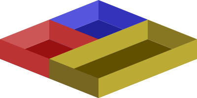

<span align="left">
  
</span>

# parabin

**parabin** is a parametric 3D bin generator for Gridfinity-style modular organizers.

It generates `.scad` and optional `.stl` files using OpenSCAD. You can specify bin size, height, whether it has a floor, and which sides get screw holes.

---

## ✅ Features

- Define bin size in grid units (e.g., `2x3`)
- Optional floor (`--no-bottom`)
- Add screw holes on any side
- Automatically places screw holes at mid-height if not specified
- STL export via OpenSCAD

---

## 📦 Requirements

- Python 3
- [OpenSCAD](https://openscad.org) in your system path (for STL export)

---

## 🧰 Usage

```bash
python3 generate_bin.py SIZE HEIGHT SCREWS [--screw-z Z] [options]
```

### Positional arguments:

| Argument     | Description                                      |
|--------------|--------------------------------------------------|
| `SIZE`       | Bin size in format `WxD`, e.g., `2x3`            |
| `HEIGHT`     | Bin height in mm                                 |
| `SCREWS`     | Screw placement codes, e.g., `a0,b2` or `none`   |

### Screw code legend:

- `a` — front side
- `b` — right side
- `c` — back side
- `d` — left side
- Number is index (starting at 0)

For example:
```bash
python3 generate_bin.py 2x3 50 a0,b2
```
This places screws on:
- front side, cell 0
- right side, cell 2

### Optional arguments:

| Option             | Description                                                              |
|--------------------|--------------------------------------------------------------------------|
| `--screw-z Z`       | Height of screw hole center in mm (default: half of bin height)         |
| `-o FILE`           | SCAD output filename (default: `bin.scad`)                              |
| `--stl`             | Export `.stl` via OpenSCAD                                               |
| `--stl-ofn FILE`    | Custom name for STL output                                               |
| `--no-bottom`       | Generate bin without a floor                                             |

---

## 💡 Examples

Create a 3x4 bin, 60mm tall, with no screws and no bottom:
```bash
python3 generate_bin.py 3x4 60 none --no-bottom
```

Create a 1x2 bin, 40mm tall, screw on back (cell 0) and left (cell 1), screw holes at 25mm:
```bash
python3 generate_bin.py 1x2 40 c0,d1 --screw-z 25
```

Generate SCAD and STL:
```bash
python3 generate_bin.py 2x2 50 a0,b0 --stl
```

---

## 📁 Output

- `.scad` file describing the bin geometry
- `.stl` file if `--stl` is used

---

## 🛠 About

Parabin is designed for practical workshop organization using the Gridfinity modular standard. The bins print cleanly and are easily configurable via CLI.

---

## 🔗 License

MIT — do what you like, but attribution is appreciated.
